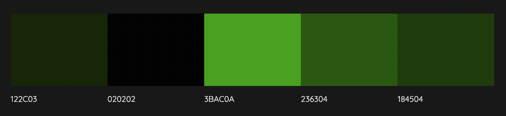
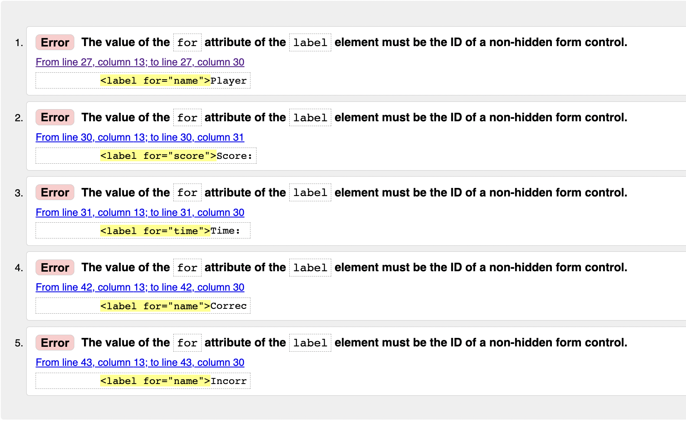
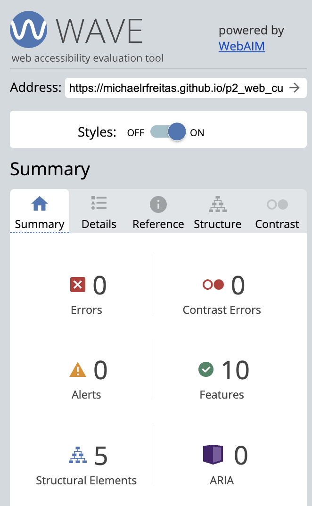

# **Curiosity Quiz - Discovery World**

Project is deployed [here](https://michaelrfreitas.github.io/p2_web_curiosity-quiz/)  
  
Github repository is [here](https://github.com/michaelrfreitas/p2_web_curiosity-quiz)    

## **Introduction**
This project is the second project part of the Full-Stack Software Development Course in [Code Institute](https://www.CodeInstitute.net).

The Curiosity Quiz is a web quiz that checks your knowledge regarding curiosities in the world. With a lot of questions and 3 choice options to an answer with pictures until 15 secs. You can stimulate your knowledge and play with your friends to know who can get the best score.

It is a quiz game regarding curiosities in the world. The quiz doesn't have a specific subject. The idea is to provide questions regarding curiosities to discover the world and check your knowledge about a lot of things like history, sports, geography and news.  

  
    
## **User Experience/User Interface (UX/UI)**

  
User Experience/User Interface (UX/UI)

  
### **User Stories**
  
  #### First Time Visitor Goals
  As a first time visitor I want:  
  - the rules and final aim of the game to be obvious.  
  - to be entertained and engaged with the game from the initial load.  
  - the game to function correctly and gameplay to be intuitive.  
  - to be able to play the game on various different devices.  
  
  #### Return/frequent Visitor Goals.
  As a return/frequent visitor I want:  
  - to be able to gauge/score my performance.
  - to be able to challenge myself by increasing difficulty of the game.
  - to be able to play the game on various different devices.
  
  #### Website's Owner Goals.
  As the developer I want:
  - to provide a fun quiz game.
  - to provide a game to stimulate knowledges.
  - to encourage continued use of the game.

  #### SiteMap

  #### User Flow

  
  ### **Design**
  
  
  #### Colour Scheme 
  I trialled  many different colour palettes whilst building the game and settled on a simple combination of shades of several green tons and black.
  Black is used for background colour in the logo and buttons. White is using for texts with contrastes with other colors.
  
  
  

  The background image is using the 3 last colors from palette above to generate a 3-Color-Gradient #3BAC0A, #236304 and #184504: 
  
  *background-image: linear-gradient(to right bottom, #3bac0a, #379e08, #329007, #2e8206, #297505, #266c05, #236404, #205b04, #1e5504, #1c5004, #1a4a04, #184504);*
      
  #### Typography
  I have choose Georgia, 'Times New Roman', Times, serif as the font for the site. It is a big bold type that stands out from the background well and is easy to read.
    
  #### Wireframes

  ##### Home Page
  

  ##### Quiz Page
  

  ##### Result Page
  

  
  

  
 ## **Features**
  

  
Features

  
### **Responsive  Website**
  The site displays properly at a wide range of screen sizes and on landscape mode, further information on this is listed in the testing section.  
  This satisfies the user need to be able to play the quiz game on various devices.   
    
    
 
    
    
  ### **Home Page**
  The instruction regarding the game is provided in the home page. Where is required to add a Player Name to start the quiz game.
    
    
 
    
    
  ### **Timer**
  For each question, there is a timer of 15 seconds to provide a correct answer. If the answer is correct, the remaining time plus 15 seconds should be added to the next question. However, if the answer is incorrect the next question should be 15 seconds again. 
    
    
  
    
    
  ### **Score**
  The score increases by 10 points when the answer is correct. However, if the answer is incorrect or the user doesn't get to provide an answer in 15 seconds the score decreases by 5 points.
    
   
    
    
  ### **Quiz Page**
  The Quiz Page will provide 10 questions to the player, each at a time, and 3 choices images to provide a unique answer for each question. On this page, there is the player name, score, timer and number of correct and incorrect answers. The page has a button to end the game before finishing if the user wants. 
    
    
   
  
  
  ### **Result Page**
  The Result Page shows the Player name, number of correct and incorrect answers in the end of the game with end score. There are two buttons Home (redirect to home page) and Restart (restart the game with same player).
    
   
    
    
  ### **Future Features**
  I would like to add extra features to the quiz game such as:
  - Increasing the number of questions from 20 to 50.
  - The result page may show all players that have played on the same machine.
  - Storage previous results to create a competition.
  - No previous questions will be repeated to the same player in the next games.
  - Ranking of players.
  
  
  
    

    
      
## **Technologies Used**
  

  
Technologies Used

  
  ### **Dev Languages Used**
  
  - HTML5
  - CSS
  - JavaScript
  
  ### **Applications Used**
  
  - [Balsamiq](https://www.balsamiq.com) was used to create wireframes for this project.
  - [GitPod](https://www.gitpod.io/) was used as an online IDE.
  - [GitHub](https://github.com/) is used to store the projects code and version control.
  - [GitPage](https://pages.github.com/) are used to deploy the site.
  - [Chrome Developer Tools](https://developer.chrome.com/docs/devtools/) used for layout, testing console and responsive testing.
  - [Wave](https://wave.webaim.org/) used for accessibility testing.
  - [Favicon.io](https://favicon.io/favicon-generator/) used for creating favicon.
  - [W3c Validator](https://validator.w3.org/) used to test HTML and CSS code.
  - [JSHint](https://jshint.com/) used to validate JavaScript code.
  - [TinyJPG](https://tinyjpg.com/) was used to compression the image files to improve performance.
  - [Am I responsive](https://ui.dev/amiresponsive) was used to create a responsive image.
  - [Character Count](https://www.charactercountonline.com/older-versions/v2/) was used to add commit with max 50 characteres.
  - [W3Schools](https://www.w3schools.com/) was used to reference code for HTML, CSS and JavaScript.
  - [ColorSpace](https://mycolor.space/) was used to generate a gradient background image.
  - [Colormind](http://colormind.io/) was used to generate a color palette.
  - [ConvertCSV](https://www.convertcsv.com/) was used to convert CSV file to JSON file.
  - [Lucidchart](https://www.lucidchart.com/) was used to create a user flow and sitemap.
 

  
  

    
      
## **Testing**
  

  
Testing

  
  ### **Lighthouse**
  #### Home Page Desktop 
   

  #### Home Page Mobile
   

  #### Quiz Page Desktop
   

  #### Quiz Page Mobile
   

  #### Result Page Desktop
   

  #### Result Page Mobile
   

  ### **W3c CSS Validator**
  No errors were found when passing through the official Jigsaw CSS Validator.
  
   \
  [CSS - Jigsaw CSS Validator](https://jigsaw.w3.org/css-validator/)
  
  ### **W3c HTML Validator**
  Some errors and warnings have been found when validated the code through official W3C HTML Validator. All of them has been fixed.
  
  #### Home Page Errors
  
  
  #### Home Page No Errors
  

  #### Quiz Page Errors
  

  #### Quiz Page No Errors
  

  #### Result Page No Errors
   \
  [HTML - W3C HTML Validator](https://validator.w3.org/)
  
  ### **JSHint**
  The Javascript file was validated using JSHint, with the following result.  The `New JavaScript features (ES6)` option was ticked in the 
  Configure menu. 

  \
  [JavaScript - JSHint Validator](https://jshint.com/)
    
  ### **WAVE Web Accessibility Evaluation Tool**
  The WAVE tool was used to test the page for accessibility. No errors.

  #### Home Page
  

  #### Quiz Page
  

  #### Result Page  
  \
  [Accessibility - WAVE](https://wave.webaim.org/)

  
    
  ### **Responsiveness**
  Media queries based on screen width were used to ensure the page displayed correctly across a range of screen sizes.
  the Chrome and Edge browsers were used to test responsiveness.  
  
  The responsive testing tools included within the Google Chrome  and the Edge browsers were used to test these, all display correctly.  
  
  * I also used the device specific tool within these browsers to test a number of devices representng a wide range of device types:
  
    * Apple:
      * Ipad mini
      * Iphone 7
      * Iphone 11
      * Iphone 12
      * Iphone 13 Pro Max

    * Desktops/laptops:
      * Dell XPS15 9570 Laptop
      * MacBook Air
 
    * Browsers:
      * Chrome
      * Edge
      * Firefox
      * Safari
  
  
    
   ### **Issues Encountered Building The Quiz Game**
   I had difficulty keeping the details stored for use on the next page or game session. Examples: name, score and other details that I need to keep the game running. I'm using sessionStorange function to solve it. 
   
   Another issue was to store the questions in the system without using a proper database and find an answer with the questions and validate the correct answer after using the random created for questions and answers position. I'm using JSON to store the questions with options for the answers and correct answers then I'm using the sessionStorage to get the position and validate it doesn't matter what position the correct answer is.
                                                  
                                                    
   ### **Testing for achievement of User Goals**

   All pages have been tested across all screen sizes for a responsive experience and web pages have been Styled accordingly.
   
   During this time I realised I made some silly mistakes mainly with sizing and had to go back through and change some size values to work correctly.
   
   Once testing was completed and I was happy with the result I used validators to ensure my code was up to standard and best practices. I did this using W3C validator for HTML, Jigsaw Validator for CSS, WAVE (Web Accessibility Evaluation Tool) and Lighthouse in Google Chrome.
   
   All images are responsive.
  
  
  |                       Goal                                              |                          Outcome                                                               |
  |-------------------------------------------------------------------------|------------------------------------------------------------------------------------------------|
  |Validated if don't put a name in player name.                            |The game show me a alert to add a name as required.                                             |
  |Tested End button in Quiz Page.                                          |Send the user to Result Page with the last score, the user has got.                             |
  |Validated all rules regarding time, scores and answers.                  |When correct extra time added to the next question and 10 points increase.                      |
  |Validated if the details are showing in the result page is true.         |Name and details regarding score, correct and incorrect questions are showing right in the end. |
  |Time is running correct and incriase in the correct moment.              |Showing the new time correct in the next question depend of the previous answer.                |
     
     
  ### **Unfixed Bugs**

  No bugs identified that needs to be fixed.

  I would like more time for increase the database questions and create a ranking for players in the same session.
  
  
  

    

## **Deployment**
  

  
Deployment

  
  This project was built on the GitPod IDE using the Code Institute template found here: https://github.com/Code-Institute-Org/gitpod-full-template
    
### **Creating My Website**
To create this project I used the Code Institute Gitpod Full Template by navigating [here](https://github.com/Code-Institute-Org/gitpod-full-template) and clicking the button labelled 'Use this template'.

Next I was directed to the 'create new repository from template page' and entered in my repo name, then clicked create repository from template button.

The commands used for commits throughout the project:

git add filename - This command was used to add files to the staging area before committing.
git commit -m "commit message explaining the updates" - This command was used to to commit changes to the local repository.
git push - This command is used to push all committed changes to the GitHub repository.

### **GitHub Pages**

1. Log in to GitHub and locate the [GitHub Repository](https://github.com/michaelrfreitas/p2_web_curiosity-quiz)

2. At the top of the Repository (NOT at the top of page), locate the "Settings" Button on the menu.

3. Scroll down the Settings page until you locate the "GitHub Pages" Section.

4. Under "Source", click the dropdown called "None" and select "Master Branch".

5. Click Save and the page will automatically refresh.

6. Scroll back down through the page to locate the now published site link in the "GitHub Pages" section. [Link](https://michaelrfreitas.github.io/p2_web_curiosity-quiz/)

### **Forking**
Forks are used to either propose changes to someone else's project or to use someone else's project as a starting point for your own idea. - This is the definition from Github Docs.

1. Navigate to the GitHub Repository you want to fork.

2. On the top right of the page under the header, click the fork button.

3. Fork

4. This will create a duplicate of the full project in your GitHub Repository.

### **Clone**

1. Navigate to the Github Repository you want to clone.

2. Click the drop down menu labelled "Clone".

3. Either Download the ZIP file, unpackage locally and open with IDE (This route ends here) OR Copy Git URL from the HTTPS dialogue box.

4. Open your developement editor and open a terminal window in a directory of your choice.

5. Use the 'git clone' command in terminal followed by the copied git URL.

6. A clone of the project will be created locally on your local machine.

  

    

## **Credits**

  
Credits

 
  ### **Images**
  The answer images were downloaded from:

  - [Unsplash](https://unsplash.com/)
  - [Wikipedia](https://en.wikipedia.org)
  - [Wikimedia](https://commons.wikimedia.org)
  - [Social Media Icons](https://www.iconfinder.com/social-media-icons)
 
  ### **Code/Reference** 
  I used [MDN Web Docs](https://developer.mozilla.org/en-US/docs/Web/API/HTMLAudioElement/Audio) to learn about JavaScript reference for JSON.  
  The [W3Schools](https://www.w3schools.com/jsref/default.asp) website was also used particularly in relation to element attributes and how the best practice to set them.    
  The [Code Institute](https://www.CodeInstitute.net) course material.
  
  
  ### **Acknowledgment**
  I'd like to say thank you my mentor [Benjamin Kavanagh](https://github.com/BAK2K3) for his guidance and support throughout my project.
  
    
  
